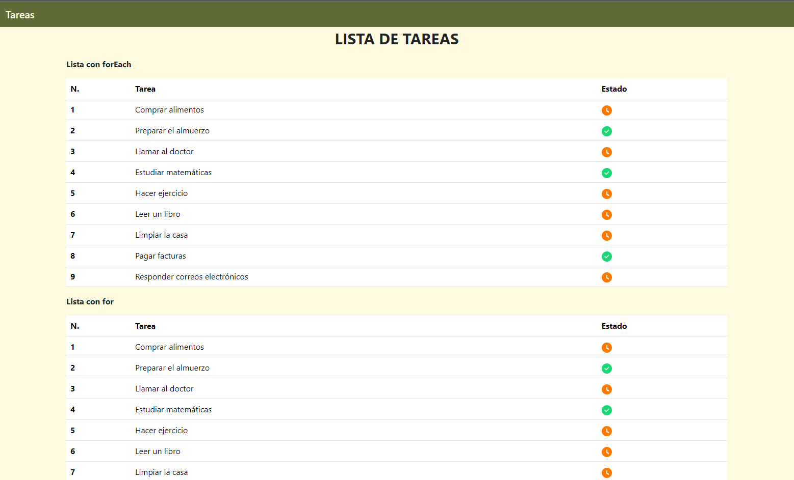

# Proyecto de Lista de Tareas

Este proyecto muestra una lista de tareas con su estado (Pendiente o Completada) utilizando HTML, CSS (Bootstrap) y JavaScript. Hay dos implementaciones: una usando el método `forEach` y otra usando un bucle `for`.

## Estructura del Proyecto

- **HTML**: Estructura del documento y elementos de la interfaz.
- **CSS**: Estilos aplicados con Bootstrap.
- **JavaScript**: Lógica para iterar y mostrar la lista de tareas.

## Requisitos

- Navegador web moderno.
- Conexión a Internet para cargar Bootstrap desde un CDN.

## Instrucciones

1. Clona el repositorio o descarga los archivos del proyecto.

